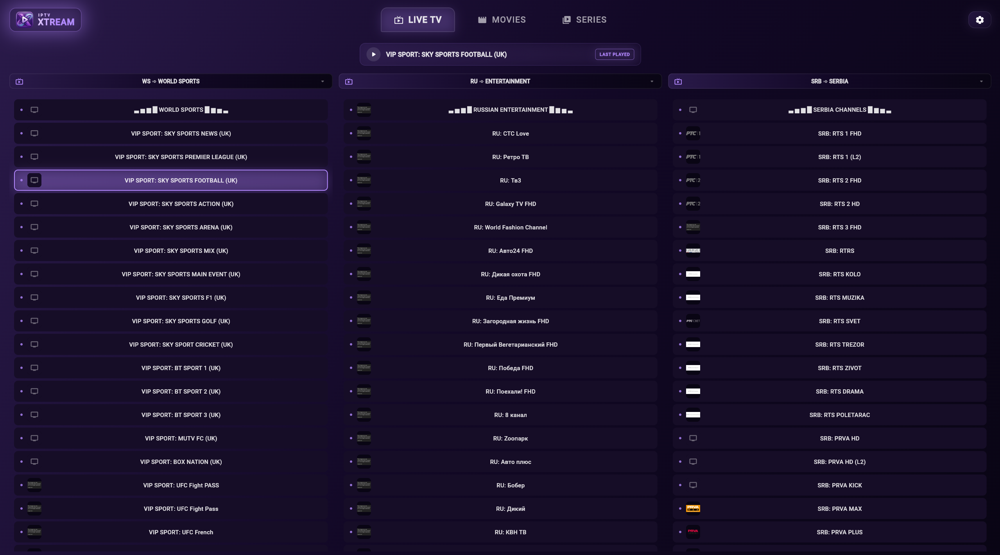
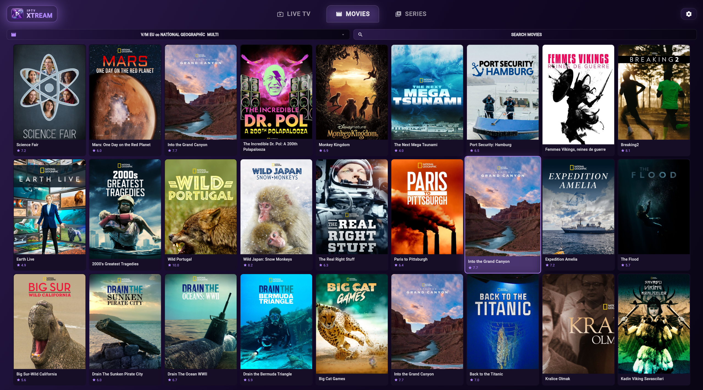
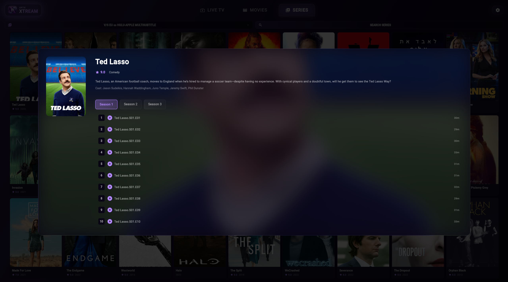

# 📺 IPTV Xtream


- A cross-platform Flutter IPTV App built for a modern streaming experience across Android, Linux, Windows and macOS.

## ✨ Features

- **Auth**: Login with your Xtream API credentials or your local M3U file.
- **Modern UI**: Parse and organize M3U data into a clean, streaming-platform-style interface.
- **Content Support**: Live TV channel streaming and advanced VOD (Video on Demand) support.
- **Living Room Ready**: Android TV-friendly layout featuring directional D-PAD navigation optimized for remote controller.

## 📸 Screenshots





## ⚠️ Hardware Acceleration

- Hardware acceleration should be explicitly enabled for builds intended to run natively on smart televisions (Google TV or Chromecast). Because real TV hardware typically features low-power CPUs, it relies entirely on dedicated GPU hardware decoding to achieve smooth video playback.

- Conversely, the player currently defaults to `enableHardwareAcceleration: false` to keep custom single-board computers (Raspberry Pi 5) more stable, as they can safely rely on their stronger general-purpose CPUs for software decoding.

- The hardware acceleration toggle is located in `lib/screens/player/player_screen.dart`.
- It currently defaults to `enableHardwareAcceleration: false`.

- If you are compiling for a dedicated television device like Smart TV, Google TV or Chromecast; change the flag before rebuilding.

```
enableHardwareAcceleration: true
```

## 📦 Downloads

- Prebuilt standalone binaries and packages for **Android (APK)**, **Linux (x64)**, **Windows (x64)**, and **macOS** are automatically built and available under the [Releases](https://github.com/Majtreax/IPTV-Xtream/releases) tab.

## 🚀 Building

- To compile the application yourself, ensure you have the Flutter SDK installed.

- Clone the repository:

```
git clone https://github.com/Majtreax/IPTV-Xtream/
```

- Fetch dependencies:

```
flutter pub get
```

- Build for your target platform:

```
flutter build apk --release
```
```
flutter build linux --release
```
```
flutter build windows --release
```
```
flutter build macos --release
```

## 📄 License

- This project is provided as-is for personal and development use.
- Adjust and extend it as needed for your own streaming setup.
